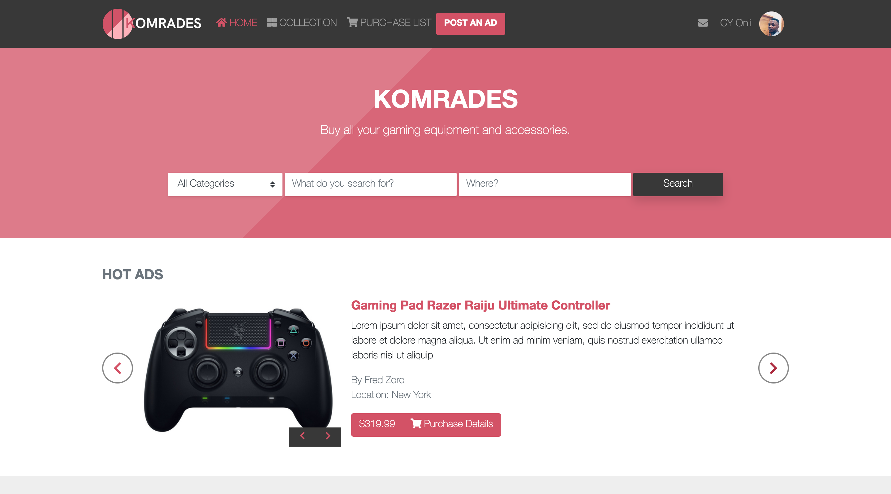
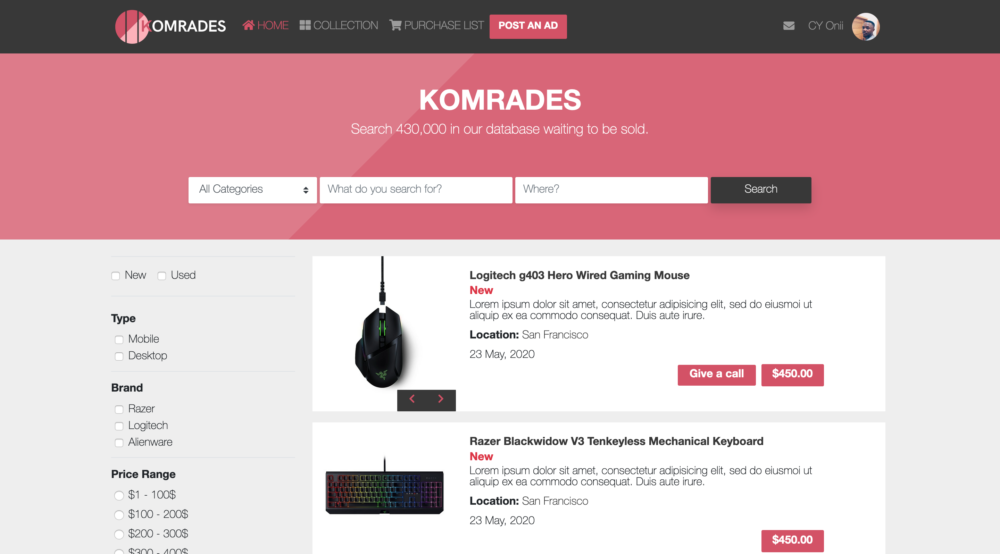

## Gaming Accessories Shop
This project is my implementation of the [design](https://www.behance.net/gallery/24796463/ZATTIX) by [Mohammed Awad](https://www.behance.net/M_Awad), it's my HTML and CSS capstone project at [Microverse](https://github.com/microverseinc).

### 🔗 Live Demo
[Live Demo Link](https://raw.githack.com/cyonii/gaming-accessories-shop/working-branch/index.html)

### ⚒️ BUILT WITH
- Bootstrap 4
- HTML
- CSS (SCSS)
- Fontawesome

### 🔤 TYPOGRAPHY
- GOTHAM FONT
  - Gotham Bold
  - Gotham Rounded Light

- HELVETICA NEUE LT COM
  - Helvetica Neue Light
  - Helvetica Neue Medium
  - Helvetica Neue Bold

### 🎨 COLORS
  This are the basic colors used on the project:
  - \#d35266
  - \#888888
  - \#383838

### 👤 Authors
   **Silas Kalu**

  - GitHub: [@cyonii ](https://github.com/cyonii )
  - Twitter: [@theOnuoha](https://twitter.com/theOnuoha)
  - LinkedIn: [@silas-kalu](https://www.linkedin.com/in/silas-kalu-2a9a13199/ )

### 🤝 Contributing
Contributions, issues, and feature requests are welcome!
